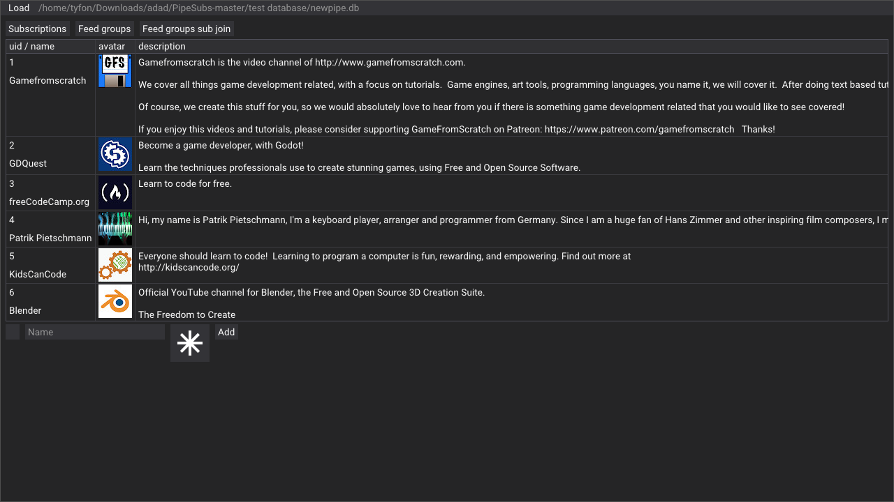
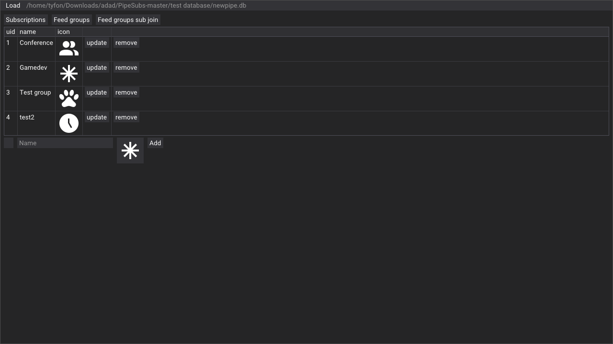
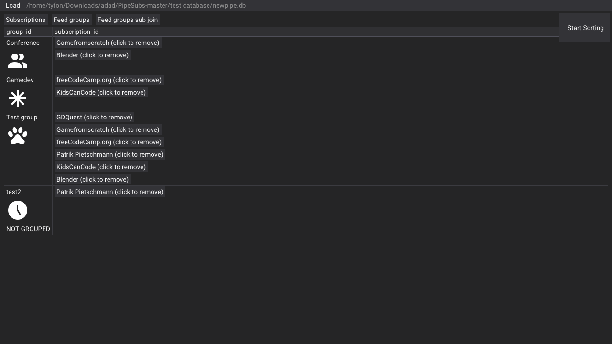

# PipeSubs

Feed group manager for NewPipe.

### binaries can be found [here](https://github.com/kifner-mateusz/PipeSubs/releases)

### manual installation

- Make venv with python `python3 -m venv env`
- Activate venv `source env/bin/activate`
- Install dependencies `pip install -r requirements.txt`
- Run app `python3 main.py`

### mini testowy manual

- otwóż bazę danych w `test database/newpipe.db` urzywająć przycisku load(lewy górny róg)
- zakładka subscriptions wyświetla zapisane subskrypcje
- zakładka feed groups zawiera grupy subskrypcji
- zakładka feed groups sub join zawiera grupy z przypisanymi do nich subskrypcjami
- przycisk start sorting (lewy górny róg zakładki feed groups sub join) włącza sortowanie, subskrypcje będą się wyświetlać po kolei i po naciśnięciu przycików na dole ekranu zostaną przypisane do grupy

### Full manual

- Open NewPipe app, import subscriptions
- Export database (Settings > Content > Export database)
- Send it to PC
- Extract files, you should have newpipe.db and newpipe.settings files
- Open PipeSubs and load newpipe.db
- In feed groups you can add/update/remove your groups
- In feed groups sub join you can remove subscription from group or start serting with button in right top corner
- When you are done repack your database as zip(make sure that files are at root of zip)
- Send it to Phone
- Import database (Settings > Content > Import database)

